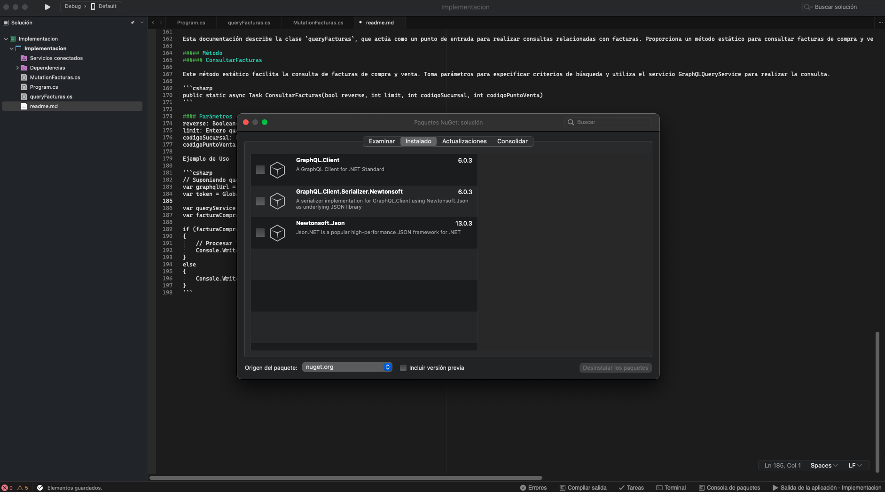


### Documentación de GraphQLService

---

#### Introducción
Esta documentación proporciona una descripción general de la clase `GraphQLService` y su uso dentro de su aplicación. La clase `GraphQLService` facilita la comunicación con una API de GraphQL, específicamente diseñada para realizar operaciones de inicio de sesión y mutación.

---

#### Tabla de Contenidos
1. [Visión General](#overview)
2. [Uso](#usage)
   - [Inicialización](#initialization)
   - [Inicio de Sesión](#login)
3. [Ejemplos](#examples)
4. [Mutation](#mutation)
   - [Metodos](#metodoMutation)
   - [Parametros](#parametrosMutation)
5. [Query](#query)
   - [Metodos](#metodoQuery)
   - [Parametros](#parametrosQuery)
6, [Librerias](#librerias)
---

#### Visión General <a name="overview"></a>
La clase `GraphQLService` está diseñada para interactuar con una API de GraphQL, especialmente para manejar la funcionalidad de inicio de sesión y realizar mutaciones. Utiliza la biblioteca `GraphQL.Client.Http` para enviar y recibir solicitudes y respuestas de GraphQL. Este servicio encapsula métodos para autenticar usuarios y ejecutar mutaciones de GraphQL.

---

#### Uso <a name="usage"></a>

##### Inicialización <a name="initialization"></a>
Para utilizar `GraphQLService`, siga estos pasos:

1. **Inicialización**: Inicialice `GraphQLService` proporcionando la URL del punto final de GraphQL.
2. **Inicio de Sesión**: Ejecute la operación de inicio de sesión para autenticar usuarios y recuperar tokens de autenticación.
3. **Realizar Mutaciones**: Utilice el servicio para ejecutar mutaciones de GraphQL para varias operaciones.

##### Inicio de Sesión <a name="login"></a>
El método `Login` dentro de la clase `GraphQLService` facilita la autenticación de usuarios. Acepta el nombre de la tienda, el correo electrónico y la contraseña como parámetros y devuelve tokens de autenticación al autenticarse correctamente.

```csharp
public async Task<dynamic> Login(string shop, string email, string password)
```

```csharp
// Inicializar GraphQLService
var graphQLService = new GraphQLService(GlobalVariables.GraphQLUrl);

// Ejecutar inicio de sesión
var loginData = await graphQLService.Login("sandbox", "nick077n@gmail.com", "13969594");

if (loginData != null)
{
    // Acciones después del inicio de sesión exitoso
}
else
{
    Console.WriteLine("Error en la autenticación.");
}
```

```csharp
// Ejemplo de cómo utilizar el servicio para mutaciones después del inicio de sesión
dynamic input = ObtenerDatosParaFactura();
await MutationFacturas.RegistrarFacturaCompraVentaOnline(input);
```


¡Recuerda modificar y adaptar el código según las necesidades específicas de tu aplicación!

#### Mutacion <a name="mutation"></a>

Esta documentación describe la clase `GraphQLMutationService`, diseñada para facilitar mutaciones GraphQL específicas para la creación de facturas de compra y venta en línea. Utiliza un cliente GraphQL para enviar solicitudes de mutación al servidor GraphQL especificado.

La clase `GraphQLMutationService` se inicializa proporcionando la URL del servidor GraphQL y el token de autenticación. Esto permite que las solicitudes de mutación estén autorizadas y autenticadas.

```csharp
public GraphQLMutationService(string graphqlUrl, string token)
```

##### Métodos <a name="metodoMutation"></a>
MutationFacturaCompraVentaCreate
Este método realiza una mutación para crear una factura de compra y venta en línea. Toma un objeto input que contiene los datos necesarios para la creación de la factura.

```csharp
public async Task<dynamic> MutationFacturaCompraVentaCreate(dynamic input)
```

##### Parámetros <a name="parametrosMutation"></a>
input: Objeto dinámico que contiene los datos de entrada necesarios para crear la factura de compra y venta.

###### Respuesta

El método devuelve un objeto dinámico que contiene la respuesta de la mutación. Si la mutación se ejecuta con éxito, la respuesta incluirá información relevante sobre la factura creada, como el ID de la factura, la representación gráfica, detalles del cliente, etc. En caso de error, la respuesta será nula.

#### Clase MutationFacturas <a name="claseMutation"></a>

Esta documentación describe la clase MutationFacturas, que actúa como un punto de entrada para ejecutar mutaciones relacionadas con facturas. En particular, proporciona un método estático para registrar facturas de compra y venta en línea utilizando el servicio GraphQLMutationService.

##### Método
###### RegistrarFacturaCompraVentaOnline
Este método estático facilita el registro de una factura de compra y venta en línea. Toma un objeto input que contiene los datos necesarios para la creación de la factura y utiliza el servicio GraphQLMutationService para realizar la mutación.

```csharp
public static async Task RegistrarFacturaCompraVentaOnline(dynamic input)
```

##### Parámetros
input: Objeto dinámico que contiene los datos de entrada necesarios para crear la factura de compra y venta.

##### Ejemplo de Uso

```csharp
// Suponiendo que tienes la URL y el token almacenados en variables globales
var graphqlUrl = GlobalVariables.GraphQLUrl;
var token = GlobalVariables.Token;

var mutationService = new GraphQLMutationService(graphqlUrl, token);
var facturaCompraVentaData = await mutationService.MutationFacturaCompraVentaCreate(input);

if (facturaCompraVentaData != null)
{
    // Procesar los datos de la facturaCompraVentaData aquí
    Console.WriteLine("Factura registrada exitosamente:");
    Console.WriteLine(facturaCompraVentaData);
}
else
{
    Console.WriteLine("Error en el registro de factura.");
}

```

#### Mutacion <a name="query"></a>

Esta documentación describe la clase `GraphQLQueryService`, la cual está diseñada para facilitar consultas GraphQL específicas para obtener datos de facturas de compra y venta. Utiliza un cliente GraphQL para enviar solicitudes de consulta al servidor GraphQL especificado.

##### Inicialización
La clase `GraphQLQueryService` se inicializa proporcionando la URL del servidor GraphQL y el token de autenticación. Esto permite que las solicitudes de consulta estén autorizadas y autenticadas.

```csharp
public GraphQLQueryService(string graphqlUrl, string token)
```

##### Mutacion <a name="metodoQuery"></a>

`QueryFacturaCompraVentaAll` : Este método realiza una consulta para obtener todas las facturas de compra y venta disponibles, con la opción de especificar criterios de búsqueda como reverso, límite, código de sucursal y código de punto de venta.

```csharp
public async Task<dynamic> QueryFacturaCompraVentaAll(bool reverse, int limit, int codigoSucursal, int codigoPuntoVenta)
```

##### Mutacion <a name="parametrosQuery"></a>

`reverse`: Booleano que indica si se desea obtener las facturas en orden inverso.
`limit`: Entero que especifica el límite de facturas a obtener.
`codigoSucursal`: Entero que representa el código de la sucursal para filtrar las facturas.
`codigoPuntoVenta`: Entero que representa el código del punto de venta para filtrar las facturas.

##### Clase queryFacturas

Esta documentación describe la clase `queryFacturas`, que actúa como un punto de entrada para realizar consultas relacionadas con facturas. Proporciona un método estático para consultar facturas de compra y venta utilizando el servicio `GraphQLQueryService`.

##### Método
###### ConsultarFacturas

Este método estático facilita la consulta de facturas de compra y venta. Toma parámetros para especificar criterios de búsqueda y utiliza el servicio GraphQLQueryService para realizar la consulta.

```csharp
public static async Task ConsultarFacturas(bool reverse, int limit, int codigoSucursal, int codigoPuntoVenta)
```

#### Parámetros
reverse: Booleano que indica si se desea obtener las facturas en orden inverso.
limit: Entero que especifica el límite de facturas a obtener.
codigoSucursal: Entero que representa el código de la sucursal para filtrar las facturas.
codigoPuntoVenta: Entero que representa el código del punto de venta para filtrar las facturas.

Ejemplo de Uso

```csharp
// Suponiendo que tienes la URL y el token almacenados en variables globales
var graphqlUrl = GlobalVariables.GraphQLUrl;
var token = GlobalVariables.Token;

var queryService = new GraphQLQueryService(graphqlUrl, token);
var facturaCompraVentaData = await queryService.QueryFacturaCompraVentaAll(reverse, limit, codigoSucursal, codigoPuntoVenta);

if (facturaCompraVentaData != null)
{
    // Procesar los datos de la facturaCompraVentaData aquí
    Console.WriteLine(facturaCompraVentaData);
}
else
{
    Console.WriteLine("Error en la consulta GraphQL.");
}
```

##### Mutacion <a name="librerias"></a>

Estamos usando estas librerias, para una mayor facilidad a la hora de llamar y hacer peticiones.



